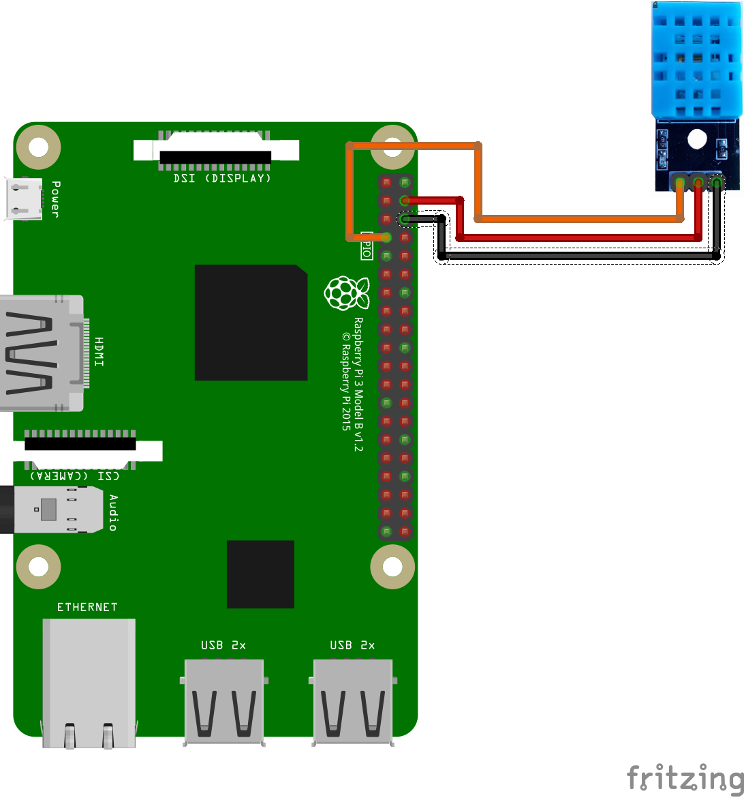
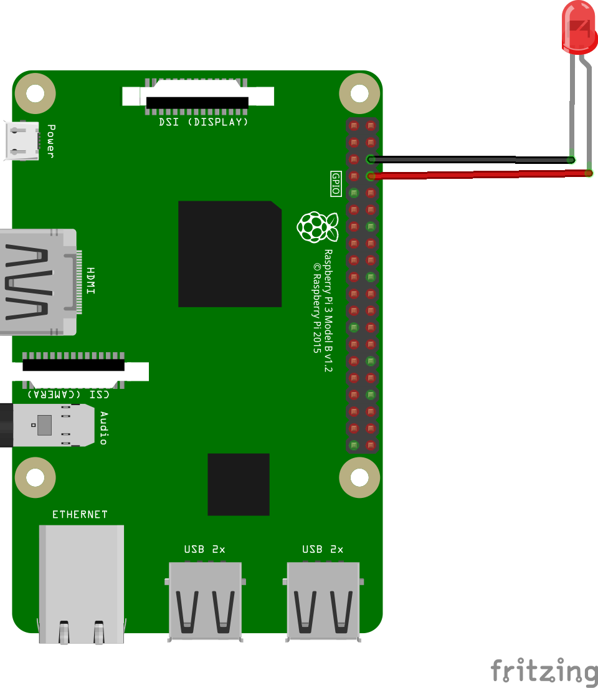
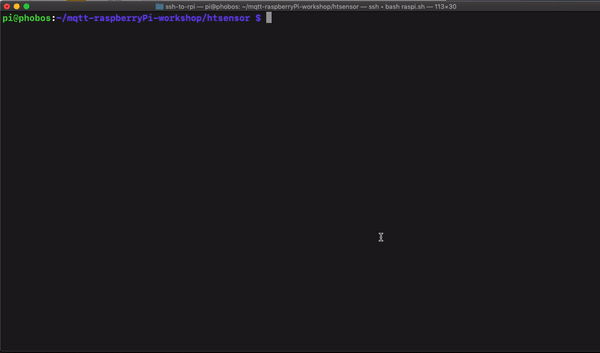
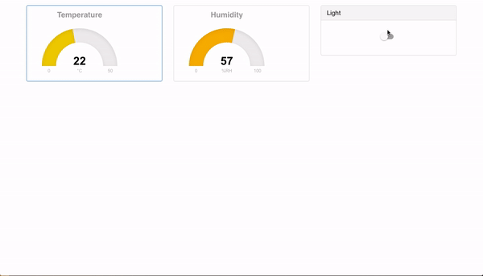

# Internet of Things in Action - Workbook

## Course Session 4 - Raspberry PI 1

The practival part of this session covers the common commands used to facilitate working with the RaspberryPi.

### Learning Objectives

By the end of this exercise, you will be able to:

- Access a RaspberryPi
- Manage a filesystem on a RaspberryPi
- Install new tools on a RaspberryPi.

### Instructions

#### Accessing the RaspberryPi

Before starting using the RaspberryPi, we need to get access to it.
First, make sure that:
- TODO: your RaspberryPi is connected to your computer via ethernet? Or Connected to the Cisco router via Wifi?

##### On Mac or Linux
If you're on Mac or Linux, you can access your RaspberryPi using a pre-installed tool called SSH (Secure SHell).
To do so, you need the username (`Pi`) and password provided by the instuctor and the IP address of your RaspberryPi"

```
[user@machine ~]$ ssh pi@<ip_address>
```

You wil be asked to enter the password of the user `Pi`.

> Note: when you enter the passowrd, **no** characters such as asterisks will be displayed.

##### On Windows
On Widnows, we need to install an SSH Client typically [PuTTY](https://www.putty.org/) or [Termius](https://www.termius.com/).

1.  Download PuTTY from [its official page](https://www.chiark.greenend.org.uk/~sgtatham/putty/latest.html).
    Double click on the installer and follow the installation wizard.
    
2.  Next, open PuTTY, and enter the following:

    - In the hostname field: the IP address.
    - Make sure that *port 22* is set, and that *connection type* is set to SSH.

    TODO: screenshot of PuTTY
    
    You'll be asked for credentials. Enter the user (`Pi`) and the password provdied by the instructor.
    
    > Note: when you enter the passowrd, **no** characters such as asterisks will be displayed.

#### Basic Linux Commands

The Operating System of the RaspberryPi is based on Debian (a Linux distribution). Thus, in this part, we'll see some basic commands for filesystem management.
In this part, we'll see some basic commands to manage filesystem on 

### Conclusion


### Material and sources:

- [presentation of Asem](data/Cisco_IoT_MQTT.pdf)

## Course Session 5 - Raspberry PI 2 - MQTT and RaspberryPi

Material and sources:

- Instructions: https://ahasna.github.io/mqtt-raspberryPi-workshop/

### What is our workshop about

This workshop is about applying MQTT protocol to turn ON/OFF a light, and to get Temperature and Humidity data and view it on an online dashboard

### What is RaspberryPi

RaspberryPi is an open-source, low cost computer on a chip, in other words it is a cheap and small computer.
The affordable price, the small size and the powerful hardware make RaspberryPi a perfect core for lots of IoT Projects.
You can find more about RaspberryPi [here](https://www.raspberrypi.org/)

### What is MQTT

MQTT is a machine-to-machine (M2M)/"Internet of Things" connectivity protocol.
Further reading can be found [here](http://mqtt.org/)

### How we will do it

The idea is to use a Dashboard to control light and to monitor the data received form the Temperature/Humidity sensor.
What really happens behind the scenes when we move the button on the dashboard, is that a function will be triggered to send an MQTT message with a specific topic, on the other hand the python code that runs on the RaspberryPi is connected  to the same MQTT Broker and subscribed to the same topic, and we have already specified in out code that if we received an MQTT message with "ON" we turn on the light (we send a signal to the relay that is connected to the RaspberryPi) and vice versa.

In the same way, the python script on the RaspberryPi is sending Temperature/Humidity as MQTT messages and the dashboard s connected  to the same MQTT Broker and subscribed to the same topic, and after receiving the messages, a function is responsible about converting these messages to a user-friendly gauge.

### Further Reading and Resources

**MQTT** [mqtt.org](http://mqtt.org/)

**SSL for secure communication** [SSL](http://info.ssl.com/article.aspx?id=10241)

[**Eclipse Mosquitto**](https://mosquitto.org/)

**Eclipse Paho** [Paho library](https://www.eclipse.org/paho/)

**Cool IoT Blog** [IOT BYTES](https://iotbytes.wordpress.com/)

**Python for Beginners** [Learn Python](https://www.learnpython.org/)

### Setup

The setup has two parts:

* **On the RaspberryPi**

* **On your laptop**

#### On RaspberryPi

* ssh into yor RaspberryPi either from CLI (on MacOS and Linux):

```bash
ssh pi@<IP_ADDRESS>
```

* or using [PUTTY](https://www.putty.org/) on Windows

* clone this repo to your `RaspberryPi` by running the following command

```bash
cd ~
git clone https://github.com/ahasna/mqtt-raspberryPi-workshop.git
```

* go to the repo you've just cloned

```bash
cd ~/mqtt-raspberryPi-workshop
```

* Run the following:

```bash
sudo apt-get update
pip install paho-mqtt
```

* edit code:

```bash
cd ~/mqtt-raspberryPi-workshop/htsensor
sudo nano run.py
```

* edit lines 15 - 19 adding values to the following variables:

`mqtt_broker`, `mqtt_broker_port`, `temp_topic`, `humidity_topic` and `light_topic`

**Note:** You'll have to change the topics to unique ones of your choice to avoid receiving messages from other publishers on the same broker

```python
# VARS
mqtt_broker = "iot.eclipse.org"
mqtt_broker_port = "1883"
temp_topic = "some_topic/sub_topic" # example: asem/home/temp
humidity_topic = "some_topic/another_sub_topic" # example: asem/home/humidity
light_topic = "some_topic/also_another_sub_topic" # example: asem/home/light
# sensor/led
led_pin = 14
sensor_pin = 4
```

* if necessary edit lines 21 and 22 (in case you chose to use different GPIO Pins to connect the Sensor and LED)

* Save changes: `Ctrl + X` then `Y` then finally `Enter`

#### On your Laptop

* clone this repo to your `local machine (laptop)` by running the following command from your CLI

```bash
git clone https://github.com/ahasna/mqtt-raspberryPi-workshop.git
```

* or just download from Github as a ZIP file if you don't have `git` installed. From [here](https://github.com/ahasna/mqtt-raspberryPi-workshop)

* go to `mqtt-raspberryPi-workshop/dasboard/js` (the repo you've just downloaded or cloned)

* edit lines 24 - 27 in `app.js` to add the `MQTT_BROKER_ADDRESS` and make sure that the MQTT topics match those in `run.py` (in RaspberryPi)

```javascript
const mqtt_broker = "iot.eclipse.org";
const temp_topic = "some_topic/sub_topic"; // example: asem/home/temp
const humidity_topic = "some_topic/another_sub_topic"; // example: asem/home/humidity
const light_topic = "some_topic/also_another_sub_topic"; // example: asem/home/light
```

### connect Circuits

#### Temp./Humidity sensor (DHT11)

follow the diagram below to connect the sensor to your RaspberryPi



#### LED

follow the diagram below to connect the LED to your RaspberryPi



for more details see the GPIO layout for RaspberryPi3 below


### Running the Code

#### RaspberryPi

* ssh into yor RaspberryPi either from CLI by using:

```bash
ssh pi@<IP_ADDRESS>
```

or using [PUTTY](https://www.putty.org/)

* go to the repo you've cloned

```bash
cd ~/mqtt-raspberryPi-workshop/htsensor
python run.py
```

* Run the following:

```bash
sudo apt-get update
pip install paho-mqtt
```

#### Dashboard

* go to `mqtt-raspberryPi-workshop/dasboard/`
* open `index.html` in browser

#### Expected results

if everything runs as expected you should see the following:

##### RaspberryPi CLI



##### Browser



### Is all of this too easy for you?

if what we have been doing so far is not challenging enough for you, try controlling the LED using the Temp./Humidity values and add an indication alert of that to the dashboard

## Course Session 6 - Microsoft Session #1

## Course Session 7 - Microsoft Session #2

Difference between IoT Hub and IoT Central.

IoT Hub is a PaaS / is an event broker.
while IoT Central is SaaS / is much more than an IoT Hub / it comes with several things e.g. the IoT Hub and Analytics and Visualization.

## Course Session 8 - Microsoft Session #3

1.  With RaspberryPi connected to your computer and running, visit on your browser <pi-ip>:1880, you should see the Node-RED page.

2.  Add an **inject** block, double click on it and change the settings to the following:
    -

3.  Insert a Raspberry element "rpi dht22" and modify its settings:
-

4.  Add a block  **Debug** element from the **Output** section.

5.  Connect your RaspberryPi to your computer via HDMI.

6.  Insert a **Template** element from section **fuction** and add following message:

    ```
    {
       "deviceId":"YOURDEVICE",
       "key":"DEVICEKEY_FROM_AZUREPORTAL",
       "protocol":"mqtt",
       "data":{
           "deviceId":"YOURDEVICE",
           "temperature":{{payload}},
           "humidity":{{humidity}}

       }
    }
    ```

7.  Add an element **IoT Hub** from the **Cloud** section.

Get the hostname of your device from the IoT Hub (make sure you added your device to the cloud service):
    -


8.   In the Azure portal, go to IoT Hub (if you don't see it, search for it in th esearch field) > **redischool01**.


## Course Session 9 - Microsoft Session #4

## Course Session 11 - Business modeling IoT - practice
