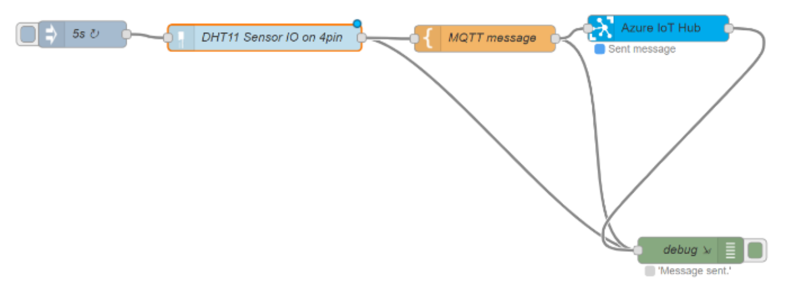

# Internet of Things in Action - Workbook

## Course Session 4 - Raspberry PI 1

The practival part of this session covers the common commands used to facilitate working with the RaspberryPi.

### Learning Objectives

By the end of this exercise, you will be able to:

- Access a RaspberryPi
- Manage a filesystem on a RaspberryPi
- Install new tools on a RaspberryPi.

### Instructions

#### Accessing the RaspberryPi

Before starting using the RaspberryPi, we need to get access to it.
First, make sure that:
- TODO: your RaspberryPi is connected to your computer via ethernet? Or Connected to the Cisco router via Wifi?

##### On Mac or Linux
If you're on Mac or Linux, you can access your RaspberryPi using a pre-installed tool called SSH (Secure SHell).
To do so, you need the username (`Pi`) and password provided by the instuctor and the IP address of your RaspberryPi"

```
[user@machine ~]$ ssh pi@<ip_address>
```

You wil be asked to enter the password of the user `Pi`.

> Note: when you enter the passowrd, **no** characters such as asterisks will be displayed.

##### On Windows
On Widnows, we need to install an SSH Client typically [PuTTY](https://www.putty.org/) or [Termius](https://www.termius.com/).

1.  Download PuTTY from [its official page](https://www.chiark.greenend.org.uk/~sgtatham/putty/latest.html).
    Double click on the installer and follow the installation wizard.
    
2.  Next, open PuTTY, and enter the following:

    - In the hostname field: the IP address.
    - Make sure that *port 22* is set, and that *connection type* is set to SSH.

    TODO: screenshot of PuTTY
    
    You'll be asked for credentials. Enter the user (`Pi`) and the password provdied by the instructor.
    
    > Note: when you enter the passowrd, **no** characters such as asterisks will be displayed.

#### Basic Linux Commands

The Operating System of the RaspberryPi is based on Debian (a Linux distribution). Thus, in this part, we'll see some basic commands for filesystem management.
In this part, we'll see some basic commands to manage filesystem on 

### Conclusion


### Material and sources:

- [presentation of Asem](data/Cisco_IoT_MQTT.pdf)

## Course Session 5 - Raspberry PI 2 - MQTT and RaspberryPi

Material and sources:

- Instructions: https://ahasna.github.io/mqtt-raspberryPi-workshop/

### What is our workshop about

This workshop is about applying MQTT protocol to turn ON/OFF a light, and to get Temperature and Humidity data and view it on an online dashboard

### What is RaspberryPi

RaspberryPi is an open-source, low cost computer on a chip, in other words it is a cheap and small computer.
The affordable price, the small size and the powerful hardware make RaspberryPi a perfect core for lots of IoT Projects.
You can find more about RaspberryPi [here](https://www.raspberrypi.org/)

### What is MQTT

MQTT is a machine-to-machine (M2M)/"Internet of Things" connectivity protocol.
Further reading can be found [here](http://mqtt.org/)

### How we will do it

The idea is to use a Dashboard to control light and to monitor the data received form the Temperature/Humidity sensor.
What really happens behind the scenes when we move the button on the dashboard, is that a function will be triggered to send an MQTT message with a specific topic, on the other hand the python code that runs on the RaspberryPi is connected  to the same MQTT Broker and subscribed to the same topic, and we have already specified in out code that if we received an MQTT message with "ON" we turn on the light (we send a signal to the relay that is connected to the RaspberryPi) and vice versa.

In the same way, the python script on the RaspberryPi is sending Temperature/Humidity as MQTT messages and the dashboard s connected  to the same MQTT Broker and subscribed to the same topic, and after receiving the messages, a function is responsible about converting these messages to a user-friendly gauge.

### Further Reading and Resources

**MQTT** [mqtt.org](http://mqtt.org/)

**SSL for secure communication** [SSL](http://info.ssl.com/article.aspx?id=10241)

[**Eclipse Mosquitto**](https://mosquitto.org/)

**Eclipse Paho** [Paho library](https://www.eclipse.org/paho/)

**Cool IoT Blog** [IOT BYTES](https://iotbytes.wordpress.com/)

**Python for Beginners** [Learn Python](https://www.learnpython.org/)

### Setup

The setup has two parts:

* **On the RaspberryPi**

* **On your laptop**

#### On RaspberryPi

//TODO: preset the RaspberryPi on Azure instead of with the py script. Check email from Matthias:

* ssh into yor RaspberryPi either from CLI (on MacOS and Linux):

```bash
ssh pi@<IP_ADDRESS>
```

* or using [PUTTY](https://www.putty.org/) on Windows

* clone this repo to your `RaspberryPi` by running the following command

```bash
cd ~
git clone https://github.com/ahasna/mqtt-raspberryPi-workshop.git
```

* go to the repo you've just cloned

```bash
cd ~/mqtt-raspberryPi-workshop
```

* Run the following:

```bash
sudo apt-get update
pip install paho-mqtt
```

* edit code:

```bash
cd ~/mqtt-raspberryPi-workshop/htsensor
sudo nano run.py
```

* edit lines 15 - 19 adding values to the following variables:

`mqtt_broker`, `mqtt_broker_port`, `temp_topic`, `humidity_topic` and `light_topic`

**Note:** You'll have to change the topics to unique ones of your choice to avoid receiving messages from other publishers on the same broker

```python
# VARS
mqtt_broker = "iot.eclipse.org"
mqtt_broker_port = "1883"
temp_topic = "some_topic/sub_topic" # example: asem/home/temp
humidity_topic = "some_topic/another_sub_topic" # example: asem/home/humidity
light_topic = "some_topic/also_another_sub_topic" # example: asem/home/light
# sensor/led
led_pin = 14
sensor_pin = 4
```

* if necessary edit lines 21 and 22 (in case you chose to use different GPIO Pins to connect the Sensor and LED)

* Save changes: `Ctrl + X` then `Y` then finally `Enter`

#### On your Laptop

* clone this repo to your `local machine (laptop)` by running the following command from your CLI

```bash
git clone https://github.com/ahasna/mqtt-raspberryPi-workshop.git
```

* or just download from Github as a ZIP file if you don't have `git` installed. From [here](https://github.com/ahasna/mqtt-raspberryPi-workshop)

* go to `mqtt-raspberryPi-workshop/dasboard/js` (the repo you've just downloaded or cloned)

* edit lines 24 - 27 in `app.js` to add the `MQTT_BROKER_ADDRESS` and make sure that the MQTT topics match those in `run.py` (in RaspberryPi)

```javascript
const mqtt_broker = "iot.eclipse.org";
const temp_topic = "some_topic/sub_topic"; // example: asem/home/temp
const humidity_topic = "some_topic/another_sub_topic"; // example: asem/home/humidity
const light_topic = "some_topic/also_another_sub_topic"; // example: asem/home/light
```

### connect Circuits

#### Temp./Humidity sensor (DHT11)

follow the diagram below to connect the sensor to your RaspberryPi


#### LED

follow the diagram below to connect the LED to your RaspberryPi


for more details see the GPIO layout for RaspberryPi3 below


### Running the Code

#### RaspberryPi

* ssh into yor RaspberryPi either from CLI by using:

```bash
ssh pi@<IP_ADDRESS>
```

or using [PUTTY](https://www.putty.org/)

* go to the repo you've cloned

```bash
cd ~/mqtt-raspberryPi-workshop/htsensor
python run.py
```

* Run the following:

```bash
sudo apt-get update
pip install paho-mqtt
```

#### Dashboard

* go to `mqtt-raspberryPi-workshop/dasboard/`
* open `index.html` in browser

#### Expected results

if everything runs as expected you should see the following:

##### RaspberryPi CLI


##### Browser


### Is all of this too easy for you?

if what we have been doing so far is not challenging enough for you, try controlling the LED using the Temp./Humidity values and add an indication alert of that to the dashboard

## Course Session 6 - Microsoft Session #1

In this session we will explore the *IoT Hub* of the *Azure Portal*, while connecting our Raspberry Pi to Azure.

### Preparing the Raspberry Pi

1.  Connect your Raspberry Pi to the Cisco WiFi router using following credentials:

    ```
    Network: REDISCHOOLIOT
    Password: RediSchool01
    ```
    
2.  In the Raspberry Pi, use Advanced IP address Scanner to get your IP address.

3.  SSH into your Pi using `ssh <user>@<ip>` (Don't forget to replace user and ip with the values provided to you).

### Azure Portal and the IoT Hub

Azure Portal is the management dashboard for the Microsoft Azure Cloud Platform.


1.  Sign up to https://portal.azure.com.

    > If you're not part of the ReDi School Azure organization, ask your instructor to add you.

2.  After signing in you should see the following:

    
    
3.  In the search field, look for `IoT Hub` and open it:

    
    
4.  In IoT Hub, click on `redischool01`,
    click on the **IoT devices** tab,
    click on **Add**.

6.  In the device creation form specify your `Device ID` (the primary and secondary keys will be generated), then click **Save**.

### Connecting our Pi to Azure IoT Central

IoT Central is a SaaS (software as a service) solution that allows to connect and monitor your IoT devices.

7.  Visit IoT central on this address https://redischool.azureiotcentral.com and login.

8.  Click on **device explorer**, then under `Templates`, click on **Raspberry Pi**.

9.  Click on **+** to add a your device (your Pi), then click on **Real**:

    

10. Enter your `Device ID` and `Device Name` (that you used in the IoT Hub). You should see your device in the list.

11.  Click on your device name to see a list of available sensors, e.g. humidity, temperature, etc.

## Course Session 7 - Microsoft Session #2

In this session, we will set our Raspberry Pi to send information about the humidity to the Azure IoT Hub.
The IoT Hub, as we saw in the previous session, is an event broker that handles the communication between your IoT application and the devices it manages.

1.  Connect your Raspberry Pi to your computer, run it, and get the IP of your Pi (for more information about how to do this check the previous session)

    Make sure that your temperature sensor is connected to your Raspberry Pi like mentioned in the session "MQTT and RaspberryPi".

2.  In your computer, open a browser and visit your Pi on <pi-ip>:1880. You should see the Node-RED page.

    Node-RED is a development tool for visual programming, where you can create an application based on predefined graphical elements. You have only to connect the elements and configure them correctly. Node-RED is instaled by default on the Raspberry Pi.
    
3.  Go to the User Settings of Node-RED and under **Palette > Install**, look for following modules, and click on install in front of each one:

    - node-red-contrib-azure-iot-hub
    - node-red-contrib-dht-sensor

After the installation is done, you should see the new modules in the list of blocks on the left side.

3.  In the list of blocks, grab a **inject** and add to the design surface, double click on it, then set it as follows:

    - Click on **Repeat** and select *interval* from the dropdown 
    - to the interval to 5 seconds.

4.  Insert a Raspberry element **rpi dht22** and modify its settings.

5.  In the same manner, add a block  **Debug** element from the **Output** section.

6.  Insert a **Template** element from **Function** section, double click, and add following message:

    ```
    {
       "deviceId":"YOURDEVICE",
       "key":"DEVICEKEY_FROM_AZUREPORTAL",
       "protocol":"mqtt",
       "data":{
           "deviceId":"YOURDEVICE",
           "temperature":{{payload}},
           "humidity":{{humidity}}

       }
    }
    ```
    
    Don't forget to replace your *deviceId* and *key* with the values that you get from the IoT Hub. This is possible of course only if you added your device to the cloud service, as mentioned in the previous session.

7.  Add an element **Azure IoT Hub** from the **Cloud** section, double click, then add your hostname. If you didn't already you can get the hostname of your device from the IoT Hub.

8.  Finally, connect the visual elements by dragging a line fro the output to the input of each specified element like shown in the next screenshot:

    

9.  In the Azure portal, go to IoT Hub (if you don't see it, search for it in the search field) > **redischool01**.

10. Now deploy your application by clicking on the **Deploy** button in the top right corner.
If everything is set correctly, you should see events pulled by your application and displayed in the **Debug** tab.
These events have been sent by the sensor attached to your Raspberry Pi and redirected by the IoT Hub to your application.

## Course Session 8 - Microsoft Session #3

In this session we will use *Azure Stream Analytics* to monitor the values coming from the setting of last session.

Stream Analytics is a service included in Microsoft Azure. It offers different features to filter and transform data that comes from your IoT devices - in our case the Raspberry Pi - in real time.
Stream Analytics is integrated with Azure IoT Hub.

1.  Connect your Raspberry Pi to your computer, and make sure it's running.

2.  In the course Slack channel you find a JSON shared by your instructor, copy it.

3.  Visit your Node-RED instance on `<pi-ip>:1880`, click on the **menu icon** in the top right corner, click on **Import > Clipboard** to import the copied JSON.

4.  Go to portal.azure.com. In the search field look for IoT Hub and click on it.

5.  In the IoT Hub, in the list of IoT hubs, click on **redischool01**.

6.  In the list of services, under **Explorers**, click on **IoT devices**.

7.  Add a device by clicking on **+ Add**

8.  After setting your *Device ID* and keeping the default values of all other settings, click on **Save**

9.  Copy the *Connection string-primary key* that has been generated automatically


10. In Node-RED, Paste the connection string in the imported JSON as a value of the *key* like shown in the next screenshot:

    

Now it's time to create a stream analytics job and configure it.

11. In the Azure portal, click **+ Create a resource**, look for *Stream Analytics Job*.

12. In the Stream Analytics job intro page, click **Create**, give the job a name and click **Create** again.

13. After the job is created, navigate to it. Click on **Edit query**, and paste the following SQL-like query to its *Query* field:
    ```sql
    SELECT
        Student, 
        AVG(CAST(s.Humidity as float)) Humidity,
        AVG(CAST(s.Temperature as float)) Temperature, 
        System.Timestamp as EventTime
    FROM sensorstream s
    GROUP BY TumblingWindow(second, 10), Student
    ```
    This will filter the received data and return only the average value of humidity and temperature. The last line means that the events will be grouped in a fixed-sized, non-overlapping intervals of 10 seconds.

14. Finally in Node-RED, deploy your application and go back to the *overview* of your *Stream Analytics job* in the Azure portal and watch the Monitoring section for incoming events.

## Course Session 9 - Microsoft Session #4

Like depicted in the following figure, so far we connected our IoT device - the Raspberry Pi - to the Azure IoT Hub. Data generated by temperature and humidity sensors connected to the Pi are later sent to the Stream Analytics, where they get filtered.

In this session, we will pass the data to Power BI for visualization.


1.  First, you need to create an account on [Power Bi](https://powerbi.microsoft.com/en-us/).


2.  In the left side menu, click on **My Workspace > Datasets**.

3.  Click on **+Create** in the top right corner (if it's the first time you open Power Bi, lick on Skip, then Create). Click on **New streaming dataset** and select **Azure Stream Analytics**. At this level you'll be asked to head to Stream Analytics.

4.  Go to Stream Analytics in the Azure Portal and select your Stream Analytics job from last session.

5.  In the left side bar, select **Outputs** under *Job topology*, and click on **+Add > Power Bi**.

6.  Specify an Output alias e.g. `powerbi`. Set Dataset name to `sensordata` and Table name to `sensors`.

7.  Then authorize your Power Bi account, to give analytics access to your Power Bi.

8.  Now that your Stream Analytics job is connected to your Power Bi dataset, go back to Power Bi. 

9.  To create a Power Bi dashboard, click on **+Create > Dashboard**. Give the dashboard a name and click **Create**.

10. Click **+Add tile > Custom Streaming Data > Next**, then select the data set you created previously, and click on **Next**.

11. Select a visualization type: Line chart. Click on **+Add value** and select a value from the drop down.

12. Finally Click on **Next** then **Apply**.

13. If you run your Raspberry Pi, make sure that the data is recieved by your Stream Analytics job. After a while you should be able to see data flowing through your Power Bi dashboard.


## Course Session 11 - Business modeling IoT - practice
